# Introduction.

# Overview.

## CGMS F/W.

### Digital Signal Processing for CGMS Sensor.
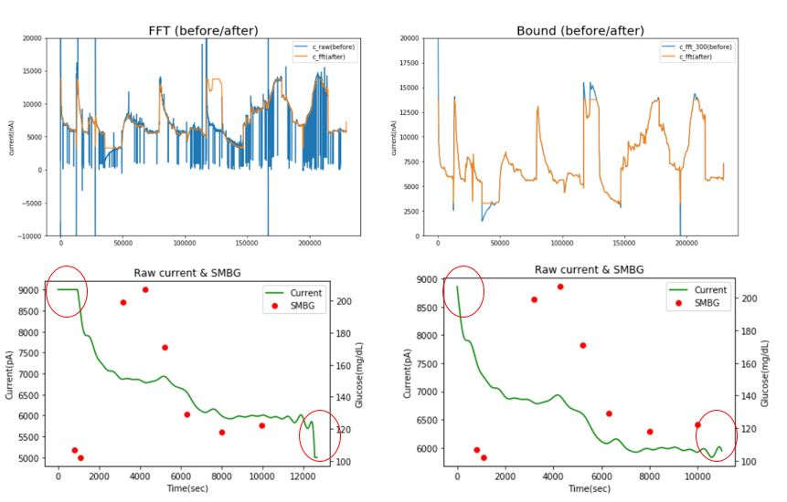

### Competitors Patent Analysis.
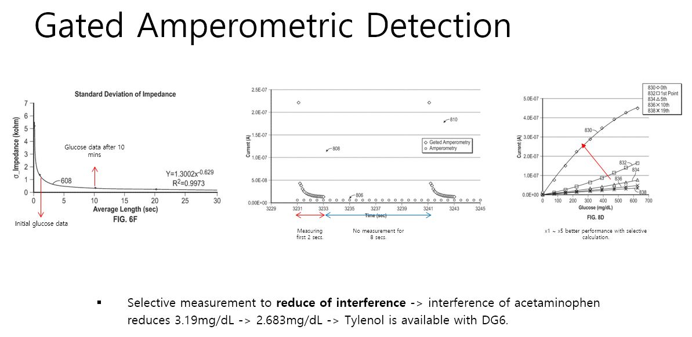

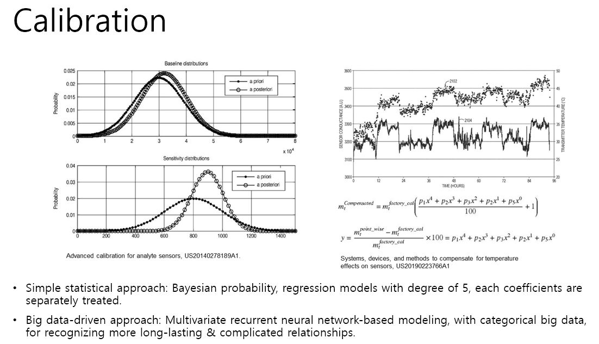

### CGMS Sensor Performance.
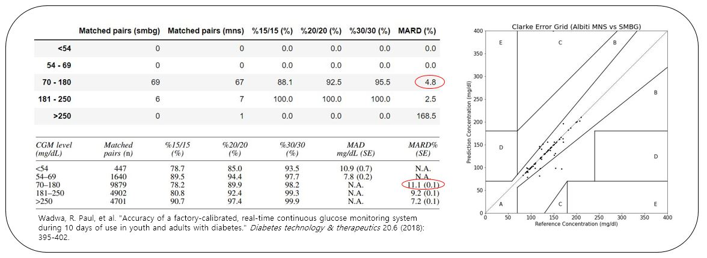

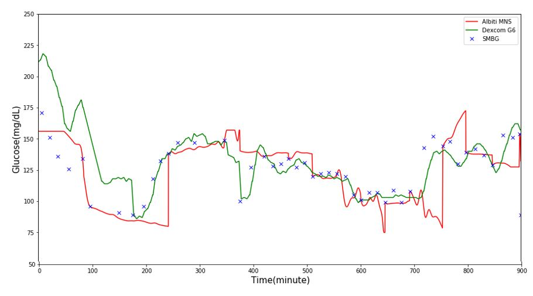

## CGMS S/W.

### Ambulatory Glucose Profile.
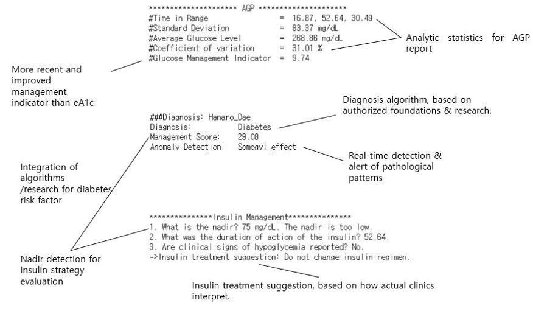

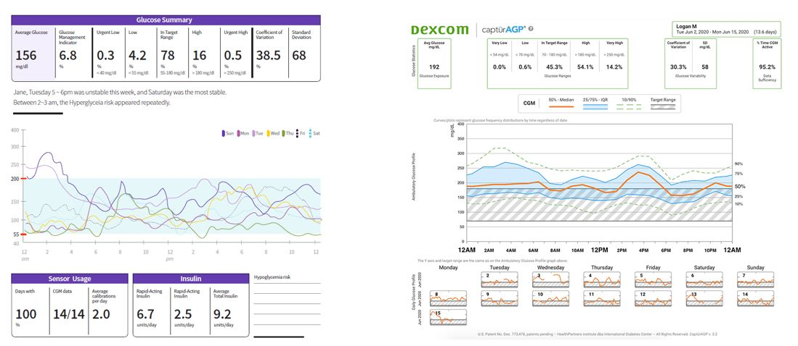

### Glucose Trend Prediction.
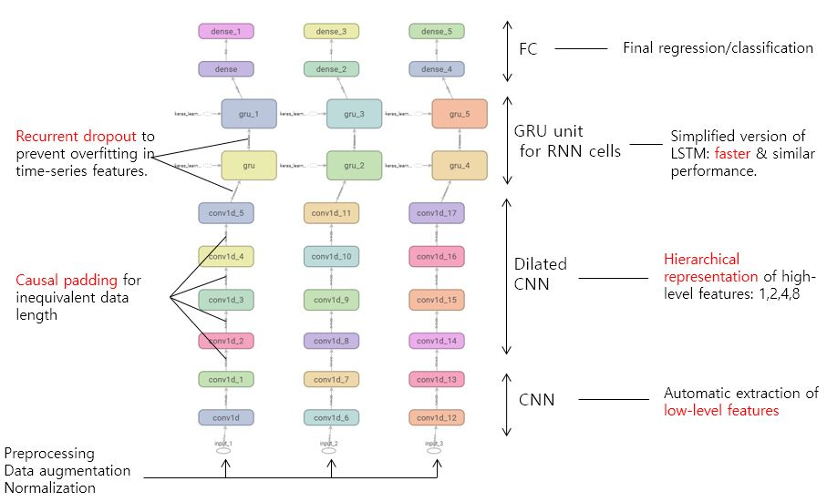

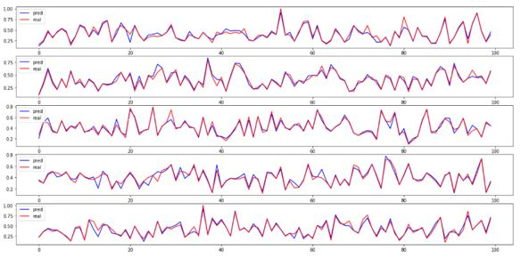

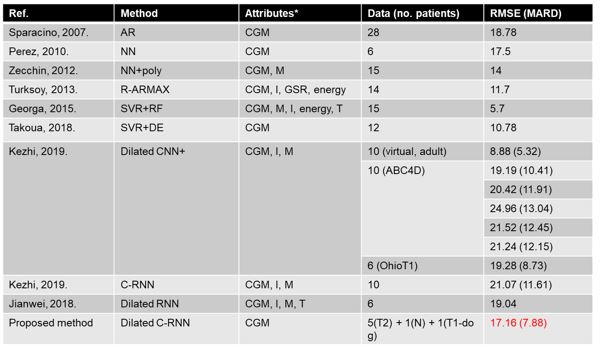

### Diabetes Onset Prediction.
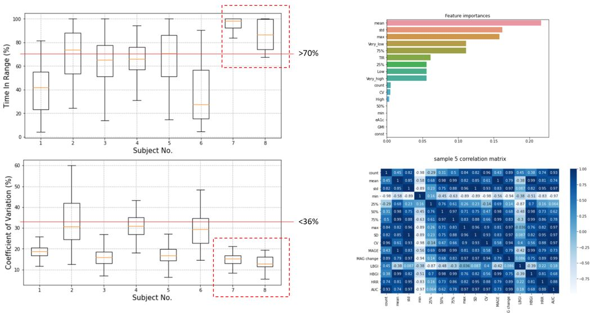

### Anomaly Detection.
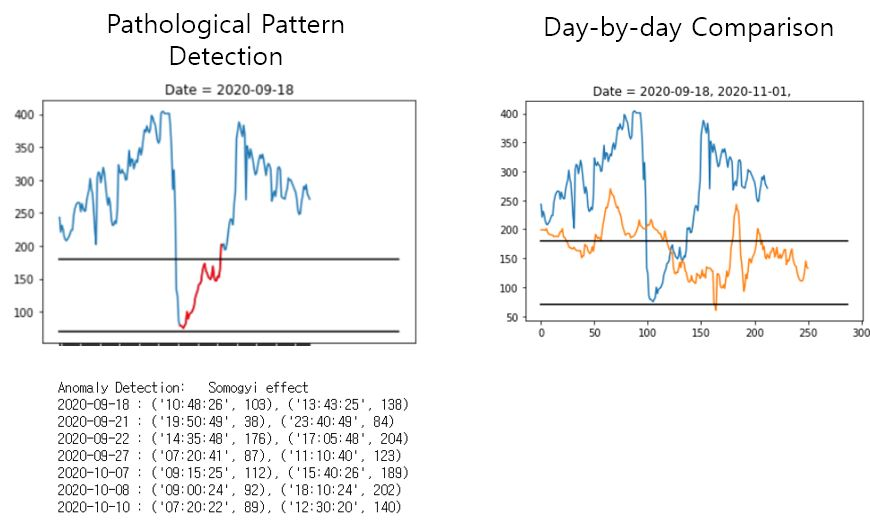

## GI-based Dietary Management.

### Glycemic Index Estimation based on CGMS.
#### Lag Time Compensation.
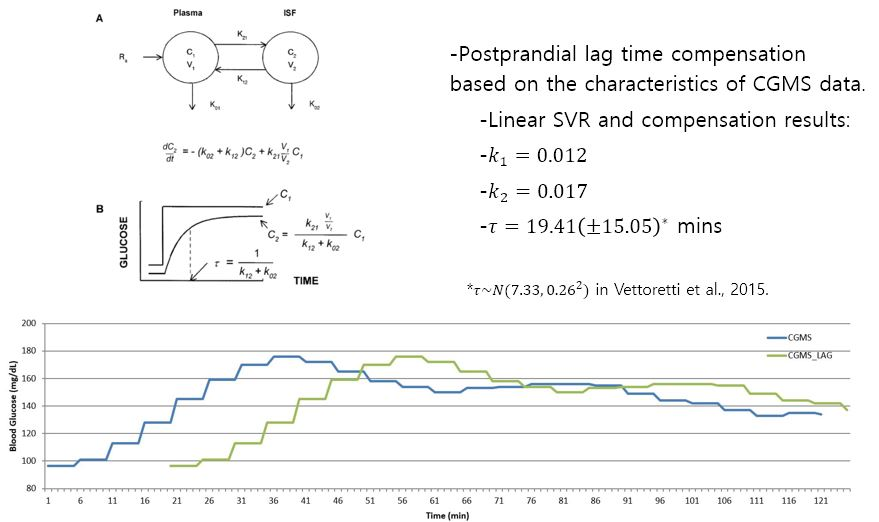

#### IAUC Estimation.
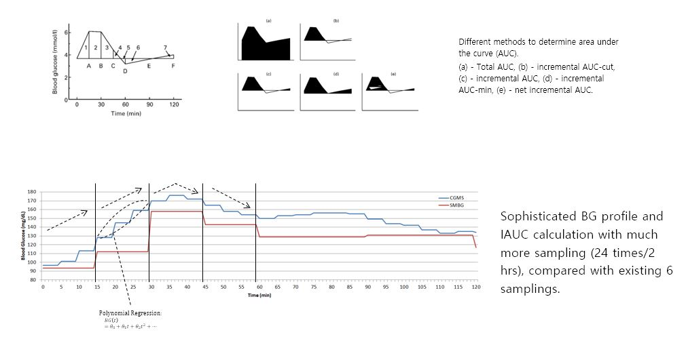

#### Mixed Foods Estimation.
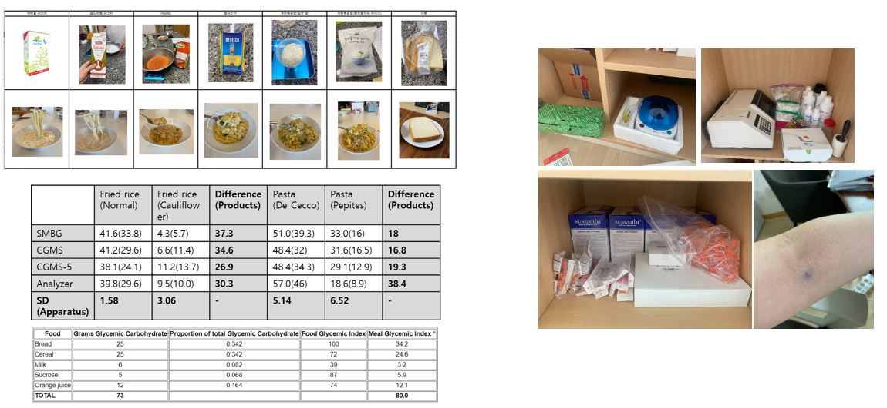

### Data Acquisition using MFDS API.
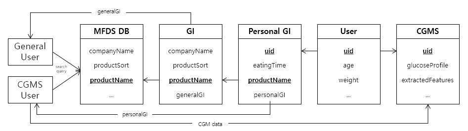

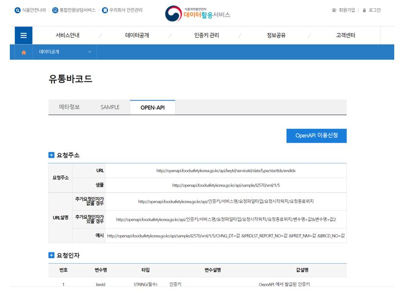

### Design.
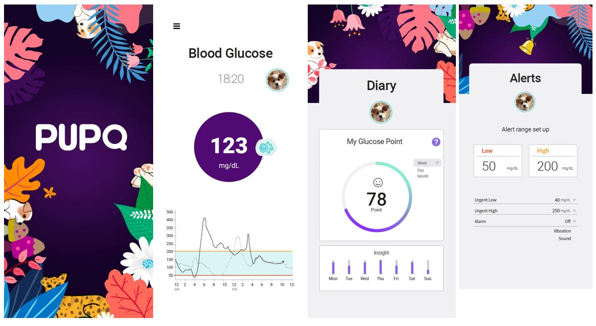

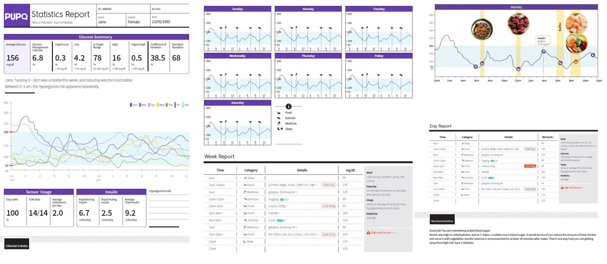

### Working Prototype.
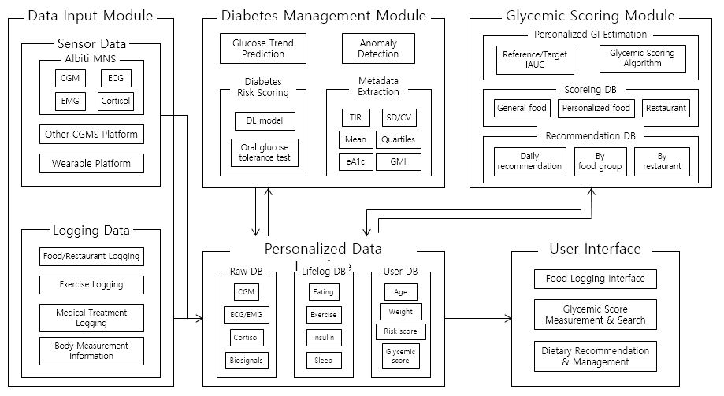

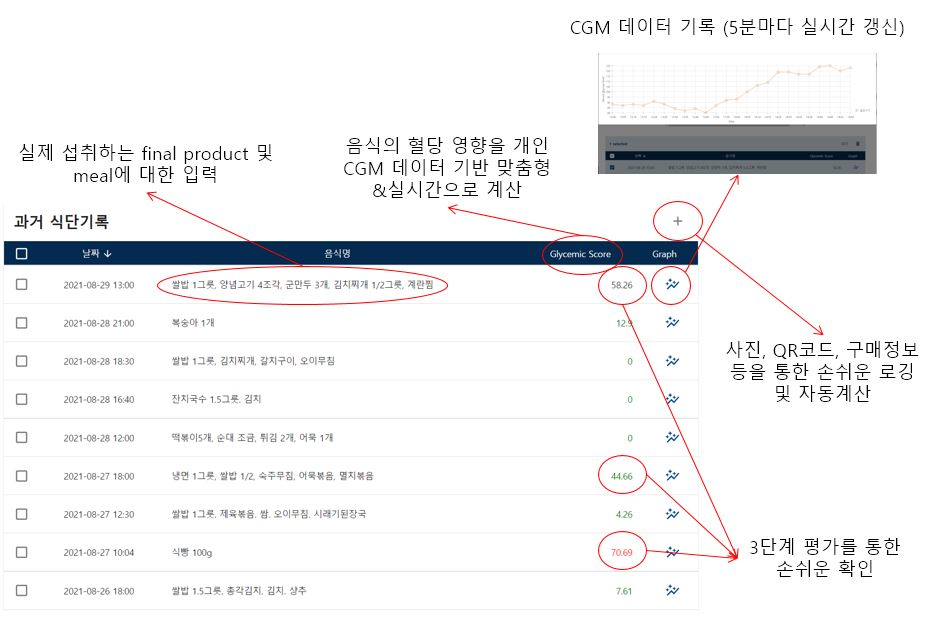

