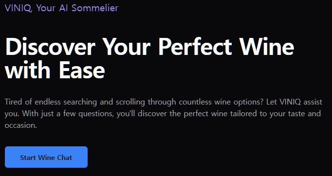
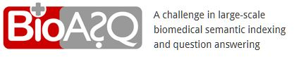
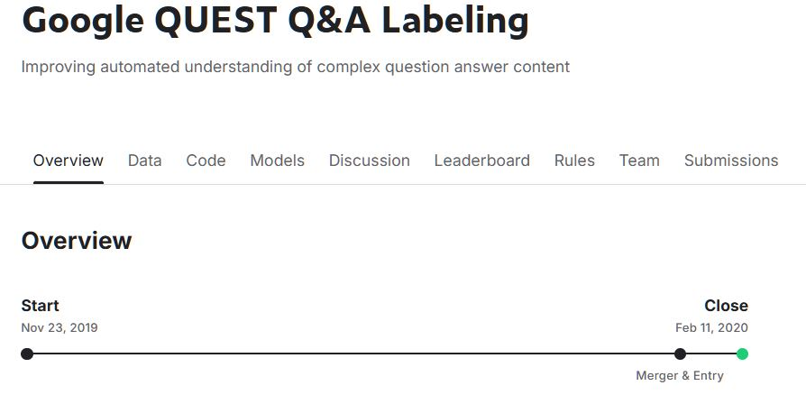

# Dear Recruiters, Fellow Data Scientists,  and Anyone Who May Be Interested

Hello!

I'm Keehoon, a Data Scientist specializing in NLP.

When I was a sophomore, I accidentally fell in love with AI. I started my research career at a lab in Yonsei University, one of the top universities in Korea.

After 5 years of academic experience earning my BS/MS degrees in Computer Science, I joined one of Korea's leading NLP companies. As a project manager and data scientist, I led a healthcare project on **Continuous Glucose Monitoring Systems for Diabetes Management** for 4.5 years. It was an entirely new and thrilling experience to lead the project from scratch as a C-level manager, collaborating with a promising startup and top-tier colleagues!

During this time, I was deeply impressed by how NLP transforms groundbreaking AI research into real-world applications. After **substantial** effort in study and practice, I’ve built a solid NLP foundation and, as of January 2025, began actively preparing my portfolio and seeking new career opportunities.

With confidence built on a solid foundation in ML and NLP, and experience as an initial member of three startups, including a C-level position, I have actively begun preparing my portfolio and seeking new career opportunities as of 2025.

Please check out my portfolio below, <b><ins>which is actively updated</ins></b>, and don’t hesitate to reach out for recruitment, projects, or any opportunities we can discuss! 

Note: This is an informal version of CV for overview. If you want formal CV, feel free to contact me.

- Email: aruwad.persona@gmail.com
- LinkedIn: (wip)
- Blog: https://velog.io/@aruwad/posts
- GitHub: https://github.com/aruwad-git/nlp-portfolio

---

# Executive Summary
- **Highlights**
  - Data scientist and project manager with 5 years of academic experience and 5 years of industrial expertise.
  - Founding member of 3 startups, including C-level roles.
  - Led the IR process for Series A funding, successfully securing approximately $X million.
  - Extensive experience in both ML R&D and project management, effectively coordinating technical teams, business teams, and customers.
  - Enthusiastic and quick learner in new, complex domains (now LLM!).
- **Skills**  
  - Fine-tuning and application of pretrained LLMs: quantization, PEFT, and BERT-like LLMs.  
  - RAG (Retrieval-Augmented Generation): RAG pipeline, asynchronous web scraping, vector database construction, prompt engineering, and fine-tuning RAG models.  
  - NLP tasks: text classification, sentiment analysis, and question answering.  
  - Application of ML and LLMs in various domains: healthcare, betting, language testing, etc.  
  - Healthcare applications: sensor calibration, trend prediction, disease prediction and management, and personalized recommendations.  
  - Skills for C-level project management in both B2B and B2C: excellent communication within and outside the team, documentation, and timeline management.
  - Experienced in R&D tasks: problem definition, experiment design, surveying papers and patents, writing and publishing papers, and data-driven decision-making.
  - Strong culture fit for global and multidisciplinary environments.  
- **Tech Stacks**
  - Basic ML: Python, Tensorflow, PyTorch, `optuna`, `sklearn`, `pandas`, `pyplot`, `scipy`, etc.
  - NLP: 🤗 Ecosystem (`transformers`, `datasets`, `tokenizer`, etc.), LangChain, `peft`, `bitsandbytes`, etc.

---

# Projects

## Viniq

<table style="border: 1px solid #ddd; border-radius: 8px; width: 300px;">
  <tr>
    <td style="padding: 0; border-right: 1px solid #ddd; width: 250px;">
      
    </td>
    <td style="padding: 10px; vertical-align: top; width: 350px; color: inherit;">
      <h3 style="margin: 0; font-size: 14px;">Viniq<a href="https://github.com/aruwad-git/nlp-portfolio/tree/main/2_Project/3_Viniq"> (code) </a> <a href=""> (blog - wip) </a></h3>
      

        - A Chatbot for Wine Recommendation and Food-paring.   
        - <b>Method</b>:Data scraping from raw blog postings, for efficient RAG construction in 1~2 days.  
        - <b>Results</b>: RAG pipeline with better domain-specific reply, used by U.S. startup for IR and other activities. 
        - <b>Keywords</b>: RAG, prompted engineering, domain-specific LLM, vector DB from URLs, asynchronized HTTP request. 
        - <b>Tech Stacks</b>: LangChain, Goose 3, FAISS, aiohttp, asyncio.
      

    </td>
  </tr>
</table>

## BioASQ - Task b 

<table style="border: 1px solid #ddd; border-radius: 8px; width: 300px;">
  <tr>
    <td style="padding: 0; border-right: 1px solid #ddd; width: 250px;">
      
    </td>
    <td style="padding: 10px; vertical-align: top; width: 350px; color: inherit;">
      <h3 style="margin: 0; font-size: 14px;">BioASQ - Task b. <a href="https://github.com/aruwad-git/nlp-portfolio/tree/main/2_Project/2_BioASQ"> (code) </a> <a href="https://velog.io/@aruwad/BioASQ-12b"> (blog) </a></h3>
      

        - A Challenge in Large-scale Biomedical Semantic Indexing and Question Answering.   
        - Top-tier Competition for Medical NLP.  
        - <b>Results</b>: 0.9541 of Macro f1 (top 1~20%, post-competition). 
        - <b>Keywords</b>: RAG, medical NLP, LLM fine-tuning, data augmentation, asynchronized HTTP request. 
        - <b>Tech Stacks</b>: LangChain, FAISS, aiohttp, asyncio, ThreadPoolExecutor, BeautifulSoup.
      

    </td>
  </tr>
</table>

## Google QUEST Q&A Labeling

<table style="border: 1px solid #ddd; border-radius: 8px; width: 300px;">
  <tr>
    <td style="padding: 0; border-right: 1px solid #ddd; width: 250px;">
      
    </td>
    <td style="padding: 10px; vertical-align: top; width: 350px; color: inherit;">
      <h3 style="margin: 0; font-size: 14px;">Google QUEST Q&A Labeling  <a href="https://github.com/aruwad-git/nlp-portfolio/tree/main/2_Project/1_Google_QUEST"> (code) </a> <a href="https://velog.io/@aruwad/Kaggle-Google-QUEST"> (blog) </a></h3></h3>
      

        - Multi-label Text Classification on Q&A Data. 
        - Open Competition in Kaggle, held by Google. 
        - <b>Results</b>: 127/1,572 (top 8%, post-competition) 
        - <b>Keywords</b>: text classification, skip connections, stage-wise fine-tuning. 
        - <b>Tech Stacks</b>: Hugging Face, sklearn, pyplot, scipy.
      

    </td>
  </tr>
</table>

---

# Work Experience

## Machine Learning Engineer (Oct 2018 – Apr 2019)  Korean Language and Artificial Intelligence (KLAI)
- Developed a prototype for Korean language autograding system for a speaking section for TOPIK test.
- Implemented services for speech recognition and grading models with a basic server architecture, using Google speech recognition API, EC2 and Sagemaker in AWS, and MySQL.
- Surveyed speech recognition algorithms for Korean and evaluation methodologies, implemented and tested basic algorithms such as the comparison of MAPD.

## Machine Learning Engineer (Apr 2019 – Sep 2019)  Doohoma Company
- Developed an AI betting model for horse racing with real-world data.
- The model incorporated various raw and handcrafted features such as biological information of the horse, horse trainer details, and past race results, and provided optimal horse combinations and betting amounts.
- Utilized rule-based preprocessing, a deep learning architecture combining CNN for low-level feature extraction, GRU for time-series learning, and a Bayesian network for stochastic inference of high-level features.

## Machine Learning Engineer (Feb 2020 – Feb 2023)  Konan Technology
- Performed object detection and classification for the project commissioned by the Ministry of National Defense of Korea, integrating YOLO4 into a data collection module and developing test procedures for weapon and vehicle recognition.
- Performed fundamental R&D on speaker recognition for Korean speakers, testing open APIs like GCP and UIS-RNN, and exploring new algorithms based on sentence-ending word analysis.
- Managed the project for Continuous Glucose Monitoring System (CGMS) and dietary management service for diabetes.
- Conducted R&D tasks, including sensor calibration algorithms, lag time compensation, glucose trend prediction, and glycemic index-based dietary management applications.
- Note: Some tasks listed here and under Konan Technology may correspond to overlapping periods due to the project's continuous development from Konan Technology to Albiti.

## Product Manager / Machine Learning Engineer (Feb 2023 – Feb 2024)  Albiti
- Continuously managed and performed R&D tasks for the CGMS project.
- Directed the IR process for Series A funding, successfully securing around $X million.
- Recruited and managed 5–10 team members with diverse backgrounds, including engineers and designers.
- Collaborated with the Inha University lab's H/W team on algorithms for non-enzymatic continuous glucose monitoring sensors, including calibration and lag time compensation.
- Surveyed 100+ research papers and patents, proposed a unique firmware algorithm design with minimal patent infringement, and worked closely with executives, engineers, and a patent lawyer.
- Managed R&D on glycemic index estimation algorithms, conducted experiments involving blood glucose analysis, and secured an MoU with the Glycemic Index Foundation.
- Planned R&D and regulatory approval processes in collaboration with Chinese hospitals and CROs, addressing GMP requirements and fast-track approval for innovative medical products.
- Led teams of 10–15 undergraduates at Yonsei University, providing lectures, challenges, and recruitment management.

## Chief Technology Officer (TBD) (Aug 2024 – Oct 2024)  Viniq AI
- Set to be hired as CTO post-funding and initiated participation in tasks.
- Developed a RAG pipeline for QA system for wine recommendation and food pairing.
- Managed the website development for a chatbot demo application based on ChatGPT 4.0 for demo and IR purposes.
- Contributed to early-stage startup planning, including a business plan for a wine recommendation and food pairing chatbot.

---

# Education

## Master’s Degree in Computer Science  
**University of Yonsei, Dept. of Computer Science**  
Seoul, Republic of Korea  
**Feb 2017 – Jul 2019**

## Bachelor’s Degree in Computer Science  
**University of Yonsei, Dept. of Computer Science**  
Seoul, Republic of Korea  
**Feb 2010 – Feb 2017**

## High School Diploma  
**Dongducheon Foreign Language High School**  
Dongducheon, Republic of Korea  
**Jun 2007 – Feb 2010**

---

# Research Papers

## Conferences
- Kim, K. H., Lee, C. S., Jo, S. M., and Cho, S. B., ["Predicting the Success of Bank Telemarketing Using Deep Convolutional Neural Networks"](https://ieeexplore.ieee.org/abstract/document/7492828), *The 7th International Conference on Soft Computing and Pattern Recognition*, 2015.11.
- Kim, K. H. and Cho, S. B., ["A Group Emotion Control System Based on Reinforcement Learning"](https://ieeexplore.ieee.org/abstract/document/7492826), *The 7th International Conference on Soft Computing and Pattern Recognition*, 2015.11.
- Kim, K. H. and Cho, S. B., ["A Dining Context-Aware System with Mobile and Wearable Devices"](https://ieeexplore.ieee.org/abstract/document/7363398), *The 14th IEEE International Conference on Ubiquitous Computing and Communications*, 2015.10.
- Kim, J. H., Kim, K. H., and Cho, S. B., ["A Sensory Control System for Adjusting Group Emotion Using Bayesian Networks and Reinforcement Learning"](https://link.springer.com/chapter/10.1007/978-3-319-32034-2_32), *The 11th International Conference on Hybrid Artificial Intelligence Systems*, 2016.04.
- Kim, K. H. and Cho, S. B., ["저전력 웨어러블 센서를 사용한 Adaptive Boosting 기반 식사 행위 인식 시스템"](https://www.dbpia.co.kr/Journal/articleDetail?nodeId=NODE07207580), *Proc. of the 44th KCC Conference*, 2017.06.
- Kim, K. H. and Cho, S. B., ["대중감성 유도를 위한 강화학습 기반 감각자극 조절시스템"](https://www.dbpia.co.kr/Journal/articleDetail?nodeId=NODE06394253), *Proc. of the 42nd KCC Conference*, 2015.06.
- Kim, K. H. and Cho, S. B., ["확률 모델링을 이용한 저전력 식사 상황 인식 시스템"](https://www.dbpia.co.kr/Journal/articleDetail?nodeId=NODE06229004), *Proc. of the 41st KCC Fall Conference*, 2014.12.

## Journals
- Kim, K. H. and Cho, S.-B., ["Modular Bayesian Networks with Low-Power Wearable Sensors for Recognizing Eating Activities"](https://www.mdpi.com/1424-8220/17/12/2877), *Sensors*, vol. 17, no. 12, pp. 1-16, 2017. <b>(SCIE; IF: 4.1 in 2022)</b>
- Kim, K. H. and Cho, S.-B., ["An Efficient Concentrative Photovoltaic Solar System with Bayesian Selection of Optimal Solar Tracking Algorithms"](https://doi.org/10.1016/j.asoc.2019.105618), *Applied Soft Computing*, vol. 83, 2019.07. <b>(SCIE; IF: 8.7 in 2022)</b>
- Kim, K. H. and Cho, S.-B., ["A Context Recognition System for Various Food Intake Using Mobile and Wearable Sensor Data"](https://koreascience.kr/article/JAKO201616553237015.page), *Journal of KIISE*, vol. 43, no. 5, pp. 531-540, 2016.05.

---

# Summary
